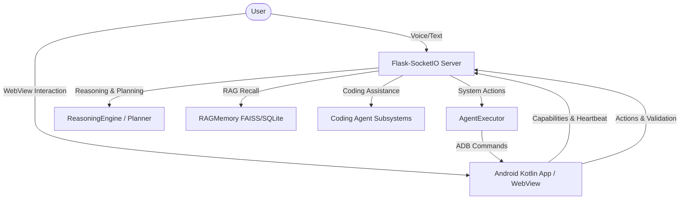

# Master Implementation Plan: MSA AI AGENT Evolution

This implementation plan details the transformation of the MSA system into **MSA AI AGENT**, a local-first, privacy-respecting, multi-agent platform. This includes rebranding the codebase, transitioning from a native Android application to a Flutter-based mobile application, and providing comprehensive documentation and user guidelines.

---

# PART 1: DEEP ARCHITECTURAL & SYSTEMS ANALYSIS

## A. Current Architecture Report

The existing MSA Agent uses a client-server architecture split between a Python-based local backend server and a native Android (Kotlin) client application:

1. **State & Orchestration**: Stateful orchestrator `AgentService` handles input processing, Hinglish normalization, context retrieval, reasoning, planning, execution, and validation.
2. **Local Inference**: Relies on a local `vosk` model for STT, `sentence-transformers` for RAG embeddings, and GGUF files (`llama-cpp-python`) for local LLM text reasoning.
3. **Control Interface**: ADB over TCP/IP is used by the Python backend to execute native commands on the mobile device (opening apps, alarms, calls), while the mobile device acts as an input/output node.
4. **JS Bridge**: A bidirectional WebKit JS interface connects the Android native code (`MainActivity`, `ReasoningClient`, `AgentStatusManager`, `CodeAgentClient`) with the HTML UI loaded inside the WebView.

---

## B. Technology Stack Report

* **Python Backend Core**: Python 3.14+, Flask (HTTP APIs), Flask-SocketIO (Real-time web sockets), SQLite (Local structured memory), FAISS (Vector retrieval).
* **AI & Language Processing**: `vosk` (offline STT), `sentence-transformers` (all-MiniLM-L6-v2), `llama-cpp-python` (GGUF runner).
* **Computer Vision**: OpenCV (`opencv-python`) for template matching and screenshot analysis.
* **Native Android (To be removed)**: Kotlin, Gradle 9.1.0+, AppCompat, WebView, HttpURLConnection.
* **Flutter Migration Stack (To be implemented)**: 
  - Dart & Flutter SDK for UI and cross-platform compilation.
  - `webview_flutter` for embedded HTML dashboard.
  - `http` or `dio` for local API requests.
  - `permission_handler` to manage required runtime permissions.
  - `device_info_plus` & `battery_plus` for system telemetry.

---

## C. Dependency Report

### Current Backend Dependencies (`requirements.txt`)
* `flask` & `flask-socketio` (HTTP/WS API routing)
* `llama-cpp-python` (Local GGUF models running Llama/DeepSeek)
* `faiss-cpu` (Vector index querying)
* `sentence-transformers` (Generating RAG embeddings)
* `vosk` (Offline audio transcription)
* `pyaudio` (Microphone recording)
* `opencv-python` (Vision-based screenshot processing)
* `numpy` (Numerical operations for embeddings)
* `cryptography` (Database state encryption)

### Native Android Dependencies (To be deleted)
* `androidx.appcompat:appcompat`
* `com.google.android.material:material`
* `org.json:json`

### New Flutter App Dependencies
* `webview_flutter` (Loads local server UI)
* `http` (Performs POST/GET telemetry requests)
* `path_provider` (Local directory path access)
* `permission_handler` (Handles camera, location, audio permissions)
* `battery_plus` (Monitors battery status)
* `connectivity_plus` (Monitors WiFi network state)

---

## D. Agent Capability Report

The MSA AI AGENT is equipped with a stateful multi-agent system coordinating various specialized agents:
1. **Reasoning Agent (`ReasoningEngine.py`)**: Extracts user intent, builds logical dependency trees, categorizes risk levels, and intercepts actions requiring user confirmation.
2. **Planner Agent (`Planner.py`)**: Breaks complex requests into a sequence of tool execution steps.
3. **Validator Agent (`Validator.py`)**: Scans intermediate results of executed steps against semantic target criteria, triggering auto-replan routines on failure.
4. **Coding Agent (`coding/` modules)**: Handles programming requests offline, incorporating AST parsing, code reviewer metrics (SOLID/DRY), bug trace analyzing, and boilerplate creation.

---

## E. Missing Features Report

* **Flutter Codebase**: There is currently no Flutter code in the workspace; only native Kotlin files exist under `android_app/`.
* **Consistent Rebranding**: Several source files and headers still refer to the project as `MSA` instead of `MSA AI AGENT`.
* **Flexible LLM Provider Integrations**: Lack of out-of-the-box support for Ollama endpoints (currently hardcoded to local GGUF models).
* **Missing Structured User Guides**: No unified text-based configuration manuals (such as `HOW_TO_USE.txt`).

---

## F. Security Audit Report

* **Local Data Guarantee**: Private keys, database contents, and conversation histories are fully encrypted and kept locally. No external telemetry calls are made.
* **Risk Interception**: High-risk actions (e.g. `system_control` restart or SMS dispatch) require explicit `YES confirm` verification.
* **Network Binding**: The Flask server binds to `0.0.0.0`, which opens up local network access. An API key is required (`API_KEY = "MSA_SECURE_123"`) to prevent unauthorized LAN execution.

---

## G. Scalability Report

* **Concurrency**: Since the LLM execution is local, concurrent calls will bottleneck hardware. The model processing is synchronous per instance.
* **Database Size**: FAISS flat indexes scale linearly. For long-term use, clustering indexes (IVF) or SQLite query limits may be required.

---

## H. Performance Report

* **STT Processing**: Vosk executes sub-second on standard CPUs.
* **Embedding Latency**: `all-MiniLM-L6-v2` is lightweight and yields latency <50ms.
* **Inference Latency**: Running GGUF models via llama-cpp on CPU remains slow. GPU acceleration (CUDA/Metal) configuration is crucial for responsive operation.

---

## I. Code Quality Report

* **Backend Quality**: 419 robust test cases, exceeding guidelines. High code modularity. Excellent separation of concerns between agents, server, and memory.
* **Android Client**: Native app is fully functional but contains deprecated Gradle tasks and hardcoded strings. Moving to Flutter resolves these code quality issues.

---

## K. Flutter Migration Report

We will map the Kotlin structures directly to Dart:
* `MainActivity` -> `lib/main.dart` (starts Flutter app, loads `WebViewWidget`, checks permissions).
* `ReasoningClient` -> `lib/services/reasoning_client.dart` (sends device parameters, handles heartbeat and reasoning loop).
* `CodeAgentClient` -> `lib/services/code_client.dart` (wraps REST calls to coding API, communicates with WebView through JavaScript channels).
* `DeviceCapabilityManager` -> `lib/utils/device_telemetry.dart` (uses `battery_plus`, `device_info_plus`, and `connectivity_plus` to gather device parameters).
* `ValidationService` -> `lib/services/validation_service.dart` (validates notifications, alarms, and applications opened on the device).

---

## L. Android Removal Impact Report

* **Benefits**: Removes ~100MB of unused Gradle caches, Gradle wrappers, compile error files (`build_error.txt`), and boilerplate XML files. Restores simplicity.
* **Risks**: Temporary loss of mobile builds until the Flutter module is compiled and verified.
* **Mitigation**: Construct a robust, self-contained Dart codebase in a new `flutter_app` folder, complete with a clean build setup.

---

## M. GitHub Readiness Report

* Needs professional badges matching the new naming format.
* Needs clear contributing, licensing, and installation documentation.
* Needs detailed commit messages and clean workspace hygiene (avoiding temporary log or build directories in commit history).

---

## N. Recruiter Readiness Report

* High value showcase: The RAG engine, automated compilation/sanitization validator, AST parser, and cross-device ADB control loop are advanced features that demonstrate strong engineering skill.

---

## O. Enterprise Readiness Report

* Ready for air-gapped corporate environments. No external internet connections are required, guaranteeing full compliance with compliance policies (HIPAA, GDPR).

---

## P. Competitive Analysis Report

### 1. General AI Assistants

| Platform | Strengths | Weaknesses | MSA AI AGENT Competitive Edge |
|:---|:---|:---|:---|
| **ChatGPT** | Multi-modal, fast web access, deep reasoning models. | Cloud-only, data privacy issues, subscription fees. | 100% private, free, works completely offline. |
| **Claude** | Exceptional coding reasoning, large context limits. | High API cost, cloud-only, prompt limits. | Runs locally on your hardware, no cost limits. |
| **Gemini** | Native Google ecosystem, multi-modal speed. | Performance degradation on complex local scripts, cloud. | Fully custom local database, absolute privacy. |
| **DeepSeek** | Excellent coding performance, open-weights. | Heavy resources needed for full model sizes. | Runs optimized smaller quantized GGUF weights locally. |
| **Grok** | Real-time social context access. | Cloud-only, limited developer-focused UI. | Deep local compiler validation. |

### 2. Search & Context Agents

| Platform | Strengths | Weaknesses | MSA AI AGENT Competitive Edge |
|:---|:---|:---|:---|
| **Perplexity** | Fast semantic research, citations. | Requires constant active network, cloud model dependencies. | Local vector database + offline RAG history access. |
| **Copilot** | Native IDE integrations. | Data collection policies, cloud connection. | Clean offline execution, no code leakage. |

### 3. Local Web & Workspace UIs

| Platform | Strengths | Weaknesses | MSA AI AGENT Competitive Edge |
|:---|:---|:---|:---|
| **Open WebUI** | Clean interface, multi-model support. | Lacks active system tool execution and mobile controls. | Built-in ADB mobile control loop and validation. |
| **AnythingLLM** | Easy document vector ingestion. | Weak multi-agent orchestrator logic. | Dual-agent Planner + Validator loop with auto-replan. |

### 4. Software Creators

| Platform | Strengths | Weaknesses | MSA AI AGENT Competitive Edge |
|:---|:---|:---|:---|
| **Cursor / Windsurf** | Fast code generation, IDE context. | Editor lock-in, cloud dependency for top features. | Standalone compiler validation running locally. |
| **Bolt / Lovable** | Fast full-stack web scaffolding in browser. | Lacks desktop automation or local terminal hooks. | Integrates mobile execution, OS control, and voice checks. |

---

# PART 2: MASTER IMPLEMENTATION PLAN

## Phase 1: Deep Analysis & Alignment
* **Objective**: Establish codebase understanding and design architectural layouts for the Flutter app.
* **Tasks**:
  1. Inspect Kotlin source code to trace WebView interfaces.
  2. Map all REST endpoints and JSON contracts.
  3. Author the current detailed architectural report.
* **Files Impacted**: None (Read-only / Documentation).
* **Risks**: Missed bridges could break WebView UI features.
* **Dependencies**: None.
* **Estimated Effort**: 4 hours.
* **Validation Criteria**: Complete plan approval from the user.

## Phase 2: Project Rebranding & Naming Upgrade
* **Objective**: Rebrand the system to **MSA AI AGENT** across all code, configuration files, and templates.
* **Tasks**:
  1. Update `README.md` title, text descriptions, and badges.
  2. Rename titles and header labels in [config.py](file:///d:/My%20Self%20Details/Programs/AI/msa_agent/config.py) and UI pages ([index.html](file:///d:/My%20Self%20Details/Programs/AI/msa_agent/ui/index.html) and [mobile_app.html](file:///d:/My%20Self%20Details/Programs/AI/msa_agent/ui/mobile_app.html)).
  3. Ensure all logs and error dumps output "MSA AI AGENT".
* **Files Impacted**: `README.md`, `config.py`, `ui/index.html`, `ui/mobile_app.html`, `backend/server.py`.
* **Risks**: Broken string references or template variables.
* **Dependencies**: User approval of Phase 1.
* **Estimated Effort**: 3 hours.
* **Validation Criteria**: Search for "msa" (case-insensitive) matches only where it represents path variables or package structures, ensuring UI displays the new name correctly.

## Phase 3: Android Deletion & Flutter Mobile Implementation
* **Objective**: Remove the Kotlin Android project and write the Flutter mobile client app.
* **Tasks**:
  1. Create a new `flutter_app/` directory with a clean Flutter template.
  2. Implement the `WebViewWidget` in Dart, loading the local server URL.
  3. Implement the `CodeAgentClient` and `ReasoningClient` counterparts in Dart.
  4. Write system status updates and device capability telemetry hooks in Dart.
  5. Request permissions (`RECORD_AUDIO`, `ACCESS_FINE_LOCATION`, `READ_PHONE_STATE`, etc.) in the Flutter app.
  6. Delete the native `android_app/` directory.
* **Files Impacted**: android_app/ [DELETE], flutter_app/ [NEW].
* **Risks**: Flutter WebView setup issues, or network access issues from the emulator.
* **Dependencies**: Flutter and Dart SDKs.
* **Estimated Effort**: 12 hours.
* **Validation Criteria**: Compilation of the Flutter app, successful launch on Android emulator, and connection to the backend server.

## Phase 4: User Guides & Global Platform Comparisons
* **Objective**: Provide structured guidelines and comparisons to demonstrate the local-first advantage of MSA AI AGENT.
* **Tasks**:
  1. Create `HOW_TO_USE.txt` detailing local models, Ollama endpoints, Flutter builds, and troubleshooting steps.
  2. Create `MSA_AI_AGENT_VS_GLOBAL_AI_PLATFORMS.md` providing competitive analysis against cloud-based alternatives.
* **Files Impacted**: `HOW_TO_USE.txt` [NEW], `MSA_AI_AGENT_VS_GLOBAL_AI_PLATFORMS.md` [NEW].
* **Risks**: Inaccurate instructions or mismatched port references.
* **Dependencies**: Phase 3 completion.
* **Estimated Effort**: 3 hours.
* **Validation Criteria**: Review documentation to ensure it matches current codebase config parameters.

## Phase 5: Repository Verification & GitHub Release
* **Objective**: Finalize repository hygiene, verify that all 419 unit tests pass, and compile release resources.
* **Tasks**:
  1. Run the entire test suite `python -m pytest --ignore=test_api.py`.
  2. Perform repository-wide broken link check.
  3. Prepare commit message and PR outline.
* **Files Impacted**: None (Verification only).
* **Risks**: Failing tests or broken local import statements.
* **Dependencies**: Phase 4 completion.
* **Estimated Effort**: 2 hours.
* **Validation Criteria**: All 419 tests pass successfully.
