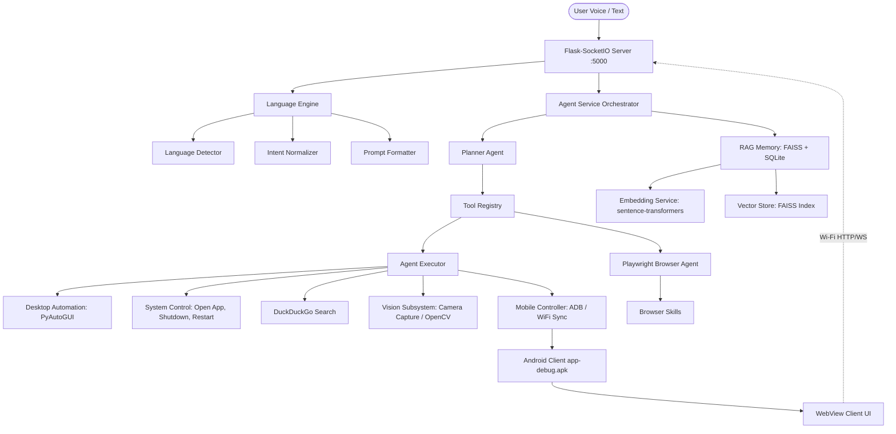

# MSA — Offline AI Agent System Documentation

MSA is a fully offline, local AI agent designed to run on a personal computer (laptop/desktop) and orchestrate system tasks, run automation, search the web, and seamlessly control a connected mobile device (Android phone) over a local Wi-Fi connection.

This system operates entirely locally, utilizing local speech models (Vosk/Whisper), speaker verification models, local LLMs (LLaMA 2/DeepSeek GGUF), and secure, encrypted storage. No external cloud APIs are needed, ensuring complete user privacy and offline functionality.

---
## 1. System Architecture

The agent is organized into modular subsystems that communicate through a central orchestration service.



---

## 2. Component & Subsystem Details

### 2.1. Voice Subsystem (`voice/`)
Responsible for catching wake words, verifying speaker identity, translating voice into text, and synthesizing text back into audio.
* **Wake-Word Detection (`wake_word.py`)**: Listens to the default audio input stream. It triggers when it detects the keyphrase `"hey msa"`.
* **Speaker Verification (`speaker_verify.py`)**: Validates the audio profile of the speaker against a trained model (`models/speaker/`). If the voice print matches the authorized owner, the agent executes commands; otherwise, it ignores them.
* **Speech-To-Text / STT (`stt.py`, `recognition.py`)**: Uses **Vosk** (via a lightweight model) or **Whisper.cpp** offline to transcribe user utterances.
* **Text-To-Speech / TTS (`tts.py`)**: Converts responses from the agent back into spoken audio.

### 2.2. Language Engine (`language/`)
Responsible for multi-lingual input processing and Hinglish synonym normalization.
* **Language Detector (`language_detector.py`)**: Detects whether the input is in English, Hindi, or Hinglish, combining Devanagari script regex checks with custom Roman Hinglish marker heuristics and statistical language models.
* **Intent Normalizer (`intent_normalizer.py`)**: Translates Hindi and Hinglish commands into standardized actions (e.g. `"VS Code start kar do"` is normalized to intent `open_app` with parameters `{"app": "vs code"}`).
* **Prompt Formatter (`prompt_formatter.py`)**: Selects and compiles response templates in the matched language of the user's input to ensure natural Hinglish or English feedback.
* **Language Manager (`language_manager.py`)**: Orchestrates the language processing pipeline as a unified facade.

### 2.3. Planner Agent & Tool Registry (`agent/Planner.py`, `tools/`)
Responsible for step breakdown and capability management.
* **Planner Agent (`agent/Planner.py`)**: Evaluates user input. If it contains task execution conjunctions (e.g. `"then"`, `"aur phir"`, `"phir"`), it splits the utterance and builds a sequential, multi-step plan containing tool dispatches. It also performs task classification (`coding_task`, `browser_task`, `mobile_task`, `system_task`).
* **Tool Registry (`tools/tool_registry.py`)**: Regulates all agent actions. Maintains definitions, parameter schemas, usage examples, and execution handlers for 17 distinct tools across system, memory, browser, mobile, and vision categories.

### 2.4. Long-Term RAG Memory (`memory/`)
Provides a semantic search engine over past conversations, developer projects, and user preferences.
* **Embedding Service (`embedding_service.py`)**: Generates 384-dimensional float32 vector representations of text using an offline-friendly `sentence-transformers` model, with a deterministic SHA-256 hash fallback if dependencies are missing.
* **Vector Store (`vector_store.py`)**: Flat L2 FAISS index wrapper that handles writing and reading semantic vector spaces locally in `msa_vectors.faiss`.
* **RAG Memory (`rag_memory.py`)**: Interleaves local SQLite database storage with the FAISS vector index, allowing both exact query retrieval and contextual semantic recall.

### 2.5. Playwright Browser Agent (`browser_agent/`)
Enables robust, browser-level interaction replacing fragile desktop macros.
* **Browser Controller (`browser_controller.py`)**: Lazily instantiates and runs a headed or headless browser instance as a reusable singleton.
* **Playwright Agent (`playwright_agent.py`)**: Provides programmatic control for navigating URLs, filling forms, clicking DOM selectors, and capturing screenshots. Includes authentication bypass for LinkedIn by querying via Google Search.
* **Browser Skills (`browser_skills.py`)**: Holds pre-built compound user flows such as searching jobs on LinkedIn or browsing video queries on YouTube.

### 2.6. Decision Engine & Core Orchestration
* **Decision Engine (`backend/decision_engine.py`)**: Interpretive core. Leverages local GGUF models via llama-cpp-python or a keyword-based fallback if offline or resource-constrained.
* **Agent Service (`agent/AgentService.py`)**: Executes the unified agent loop: language parsing -> context augmentation via RAG -> plan generation -> dynamic tool execution -> memory storage -> response.
* **Agent Executor (`agent/AgentExecutor.py`)**: Old-style direct dispatch engine serving as execution backups for desktop commands.

### 2.7. Mobile / Android Subsystem (`android_app/`)
Enables the mobile phone to function as a visual interface and control extension of the PC.
* **Native Android App**: Compiled with Gradle `9.1.0`, Android Gradle Plugin `8.9.1`, Kotlin `2.1.20`, and `compileSdk 36`.
* **WebView Integration**: Displays the responsive Web App client hosted by the local server over Wi-Fi (`http://<PC-IP>:5000/app`).
* **Hardware Permissions**: Requested dynamically (e.g. `RECORD_AUDIO` for microphone support to send voice commands).
* **Cleartext Network Config**: Configured to bypass default Android HTTP restrictions, allowing cleartext connection to local servers (`usesCleartextTraffic="true"`).

### 2.8. Web Server / Backend Dashboard (`backend/server.py`)
A Flask + Flask-SocketIO server that hosts the Web Client, processes live audio streams, and serves APIs.
* **REST APIs**:
  * `GET /`: Serves desktop control dashboard.
  * `GET /app`: Serves mobile app interface.
  * `POST /api/execute`: Receives and executes text commands.
  * `POST /api/location`: Processes GPS updates pushed from the phone.
  * `GET /api/status`: Checks health of subsystems (STT, LLM, Memory, Server).
  * `GET /api/system_info`: Returns real-time CPU, RAM, Disk usage, and server stats.
  * `GET /api/tools`: Returns the list of registered tools and their configurations.
  * `POST /api/planner`: Receives a multi-step task, builds a plan, runs execution steps, and returns results.
  * `POST /api/browser`: Directly triggers a Playwright browser automation task.
  * `GET /api/memory/search`: Performs semantic search on long-term RAG memory.

---

## 3. Directory Layout

```text
msa_agent/
│
├── main.py                     # Entry point (Flask & voice threads)
├── config.py                   # Central configurations & owner profile
├── requirements.txt            # Python package dependencies
│
├── agent/                      # Core orchestration layer
│   ├── Planner.py              # NEW: Multi-step planner agent
│   ├── AgentController.py      # Flask REST API endpoints routing
│   ├── AgentExecutor.py        # System/mobile command executor
│   ├── AgentMemory.py          # Chat context database wrapper
│   ├── AgentService.py         # Main orchestration pipeline
│   └── AgentUtils.py           # Intent parsing & keyword fallbacks
│
├── language/                   # NEW: Hinglish Language Engine
│   ├── __init__.py
│   ├── language_detector.py    # Multi-lingual detector
│   ├── intent_normalizer.py    # Command synonym normalizer
│   ├── prompt_formatter.py     # Hinglish template formatting
│   └── language_manager.py     # Unified language manager facade
│
├── memory/                     # RAG Long-term Memory layer
│   ├── __init__.py
│   ├── embedding_service.py    # NEW: Dense vector generator
│   ├── vector_store.py         # NEW: FAISS flat index wrapper
│   ├── rag_memory.py           # NEW: FAISS + SQLite semantic memory
│   └── memory.py               # SQLite base (modified with fact stores)
│
├── browser_agent/              # NEW: Playwright Browser automation
│   ├── __init__.py
│   ├── browser_controller.py   # Singleton browser controller
│   ├── playwright_agent.py     # Clicks, navigation, search automation
│   └── browser_skills.py       # Reusable complex user flows
│
├── tools/                      # NEW: Dynamic capabilities layer
│   ├── __init__.py
│   └── tool_registry.py        # 17 registered capability definitions
│
├── tests/                      # NEW: Integration and unit tests
│   ├── __init__.py
│   ├── test_language_engine.py # Tests for language engine
│   ├── test_planner.py         # Tests for planning agent
│   ├── test_rag_memory.py      # Tests for semantic memories
│   └── test_browser_agent.py   # Tests for browser automation
│
├── android_app/                # Android Application source code
│   ├── build.gradle.kts        # Root build configuration (Gradle 9.1.0)
│   ├── app/                    # App module
│   │   ├── build.gradle.kts    # App build config (SDK 36, Kotlin 2.1.20)
│   │   └── src/main/           # Android Manifest, Kotlin code, resources
│   └── gradlew.bat             # Windows Gradle wrapper execution script
│
├── backend/                    # Core automation & server logic
│   ├── server.py               # Flask-SocketIO WebSocket server
│   ├── decision_engine.py      # Local LLM & Keyword parsing router
│   ├── internet.py             # DuckDuckGo search utility
│   ├── location.py             # GPS coordinates tracking logic
│   ├── security.py             # Encrypted storage utils
│   ├── system_control.py       # Shutdown/restart execution
│   └── system_monitor.py       # CPU/RAM/Disk stats collector
│
├── ui/                         # PWA & Web dashboard assets
│   ├── index.html              # Desktop UI Dashboard
│   ├── mobile_app.html         # Mobile WebView layout
│   ├── msa_voice.html          # Clean voice interface layout
│   ├── manifest.json           # Web App PWA manifest
│   ├── sw.js                   # Service Worker script
│   └── icon-192.png / 512.png  # UI & launcher icon assets
│
├── voice/                      # Voice & Speech recognition layer
│   ├── msa_voice.py            # Background voice loop controller
│   ├── recognition.py          # Vosk/Whisper recognition utils
│   ├── speaker_verify.py       # Speaker voice verification model
│   └── stt.py / tts.py         # Speech translation pipelines
│
├── models/                     # Models directory (Vosk, Speaker prints)
└── data/                       # Encrypted database, log output files
```

---

## 4. Developer / Owner Profile

Configured inside `config.py`, this internal profile guides the local decision-making and customization context:
* **Name**: Md Sadique Amin
* **Role**: Software Engineer
* **Current Study**: B.Tech CSE (8th Semester) - GEC Patan
* **Education**: Diploma - MANUU Bangalore
* **Skills**: Java, Spring Boot, Servlet, JSP, MySQL, JDBC, JavaScript, Python, AI/ML, Data Science.
* **Project**: MSA AI Agent - Offline Multi Device AI Assistant.

---

## 5. Deployment & Execution Guide

### Running the System
1. **Train the Voice Model**: Enrol speaker voice print by running:
   ```bash
   python scripts/train_speaker.py
   ```
2. **Start the System**: Launch the daemon and server:
   ```bash
   python main.py
   ```
3. **Connect the Android App**: Ensure the phone and laptop are on the same Wi-Fi network. Find the phone's IP and place it in `mobile_ip.txt` to enable ADB. Compile and install `app-debug.apk` onto the phone to load the control screen.
4. **Running Automated Tests**: Validate system integrity:
   ```bash
   python -m pytest tests/ -v
   ```
