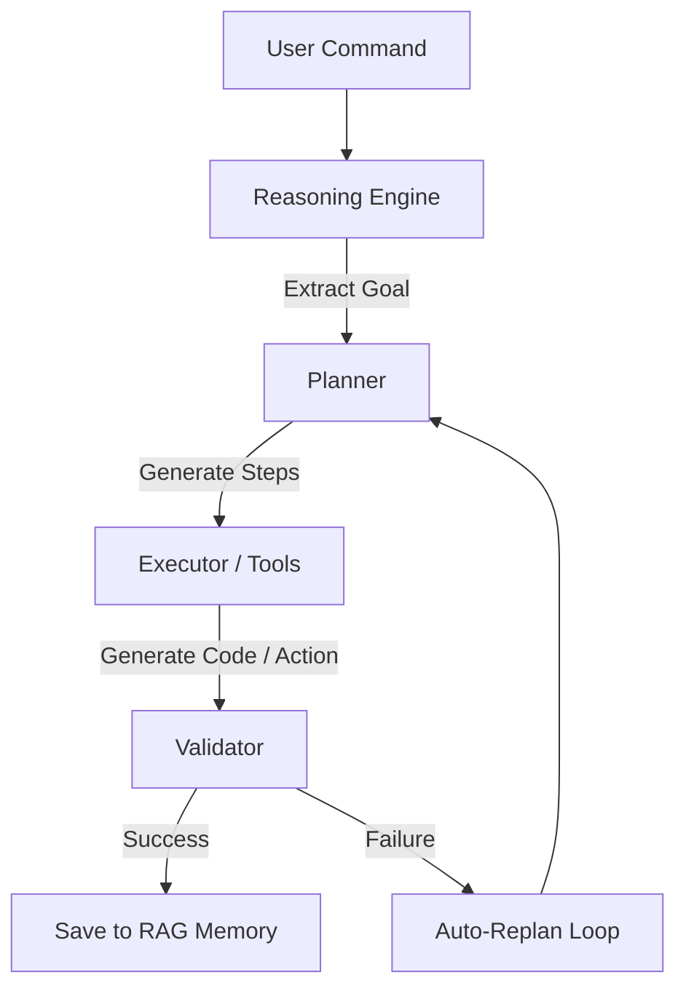

# ⚔️ MSA AI AGENT vs. Global AI Platforms: Comparative Analysis

A deep architectural and feature-based comparison of **MSA AI AGENT** against global cloud-centric AI systems (such as OpenAI's ChatGPT, Google's Gemini, DeepSeek-R1, Anthropic's Claude, and xAI's Grok).

---

## 📌 Executive Summary

Modern AI systems are overwhelmingly designed as **centralized cloud utilities**. While this allows them to run trillion-parameter models, it presents major liabilities in **data privacy**, **latency**, **operating cost**, **customization**, and **offline robustness**.

**MSA AI AGENT** is a **local-first, autonomous multi-agent ecosystem** that operates entirely on user hardware. It provides direct, zero-leakage integration with local desktop files, terminal execution environments, and mobile device hardware (via its custom Flutter WebView wrapper and ADB control loop).

---

## 📊 High-Level Comparison Matrix

| Dimension | MSA AI AGENT | Global Cloud Assistants (ChatGPT, Claude, Gemini) | Open-Weights Runners (Ollama, Open WebUI) |
| :--- | :--- | :--- | :--- |
| **Execution Locality** | 💯 **100% Local / Offline** | ☁️ 100% Cloud-dependent | 💻 Local engine, but requires custom wrappers |
| **Subscription Cost** | 🆓 **$0/month (Forever)** | 💵 $20/month base (API-pay-per-token) | 🆓 $0/month |
| **Privacy Guarantee** | 🔒 **Zero Data Leakage** (Air-gapped) | ⚠️ Data used for training (opt-out hidden) | 🔒 Local, but lacks multi-agent RAG isolation |
| **Voice Biometrics** | 🎙️ **Siamese Network Enrollment** | ❌ None (Simple voice wake/speech) | ❌ None |
| **Mobile Integration** | 📱 **Flutter Wrapper + Direct ADB Loop** | ❌ App UI only, no local device shell control | ❌ Web interface only |
| **Software Engineering** | 🛠️ **Built-in Compiler & AST Validator** | ❌ Static text output (Manual copy-paste) | ❌ Text output |
| **Agentic Loop** | 🔄 **Planner ➔ Executor ➔ Validator** | ❌ Linear chat response | ❌ Mostly linear chat |
| **Internet Access** | 🌐 **Local Scraping & Summarization** | ☁️ Cloud browser search | ❌ Requires custom plugin configs |

---

## 🧠 Deep-Dive Competitor Analysis

### 1. MSA AI AGENT vs. OpenAI ChatGPT / Claude (Anthropic)
* **The Trust Boundary**: ChatGPT and Claude process every prompt in US-based cloud datacenters. For developers working on proprietary codebases or enterprises with strict compliance rules (GDPR, HIPAA), copy-pasting source code is a compliance violation. MSA AI AGENT operates with a strict local boundary; data remains on the SSD and in local RAM.
* **The Execution Gap**: When ChatGPT generates a script, it cannot compile or test it on your system. MSA AI AGENT passes all generated code through its `CodingValidator` backend. The validator performs AST parses, runs clean import checks, and validates the output before displaying it to the user.
* **Cost Predictability**: API token fees or pro subscriptions scale with usage. MSA AI AGENT runs GGUF quantized models on CPU/GPU without costing a single cent.

### 2. MSA AI AGENT vs. Google Gemini
* **Ecosystem Lock-in**: Gemini excels when integrated with Google Workspace cloud APIs (Drive, Gmail). However, it lacks deep local control. MSA AI AGENT controls your mobile phone directly over a local Wi-Fi ADB connection, enabling native triggers (opening local apps, polling battery telemetry, setting offline alarms) without relying on Google APIs or internet access.
* **Bilingual Nuance**: Gemini handles language translations well, but MSA AI AGENT features a dedicated local `Hinglish Engine` tailored to understand mixed Hindi-English colloquial commands naturally used in India.

### 3. MSA AI AGENT vs. DeepSeek-R1 (Local vs. Cloud)
* **Model Size Optimization**: DeepSeek's cloud instances serve a massive 671B model. However, MSA AI AGENT runs local quantized GGUF weights (such as `DeepSeek-R1-Distill-Q4_K_M` or `Llama-3-8B`) optimized for local CPU and consumer GPU memory footprints.
* **Memory & Context Persistence**: DeepSeek-R1 focuses on general reasoning. MSA AI AGENT couples its LLM engine with an offline **RAG Memory** (FAISS Vector database + SQLite) to keep track of user preferences, coding history, and local documents, bypassing context limits through semantic memory retrieval.

### 4. MSA AI AGENT vs. xAI Grok
* **Social Context vs. System Context**: Grok leverages live access to the X platform. MSA AI AGENT focuses on your **personal system context**—local telemetry, developer logs, battery health, and workspace files—acting as a personal system administrator rather than a social search feed.

---

## 🏗️ Architectural Advantages of MSA AI AGENT

### A. Closed-Loop Agentic Execution
Global systems return text responses. MSA AI AGENT utilizes an active loops system:

This self-correcting validation loop ensures that tasks are not just answered, but successfully completed and verified.

### B. Device Hardware Synthesis via Flutter
By replacing the legacy native Android code with a **Flutter application wrapper**, MSA AI AGENT offers cross-platform parity. The Flutter app serves as a telemetry client:
1. **Sensors & System Information**: Captures WiFi connectivity status, battery drainage metrics, and storage capacities using modern plugins (`battery_plus`, `connectivity_plus`, `device_info_plus`).
2. **REST Sync Bridge**: Heartbeats are regularly sent to the Flask backend server, feeding current device telemetry directly into the Reasoning Engine's planning context.
3. **ADB Control Plane**: The Python backend can invoke system-level scripts via ADB over TCP/IP to execute actions (running packages, toggling features) on the device, closing the loop.

---

## 🔒 Security & Privacy Assertions

* **Anti-Telemetry Policy**: MSA AI AGENT is completely devoid of tracking scripts, telemetry pixels, or analytical call-homes.
* **Key Encryption**: Encrypted databases use AES-256 keys generated on setup and kept locally, preventing disk-level access by third-party software on the host.
* **Network Restrictions**: The Flask server binds on local interfaces. Authentication is secured by a static authorization token (`X-MSA-Key: MSA_SECURE_123`) to prevent unauthorized LAN device connection.
