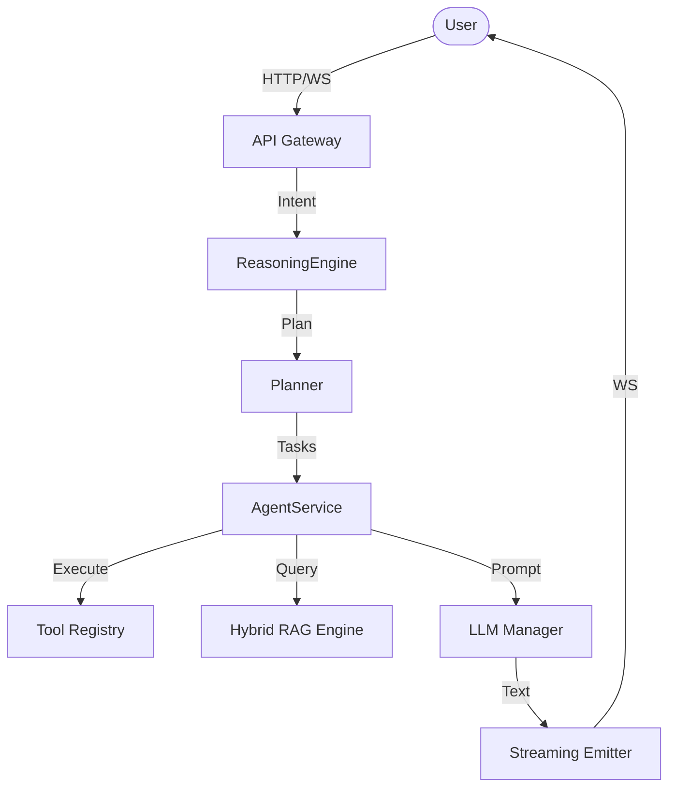

# Project Audit — MSA AI Agent V4.5

## 1. Current Architecture

The MSA AI Agent uses a local-first, multi-agent orchestrator (`AgentService`) that coordinates planning, execution, and validation cycles.

---

## 2. Structural & Architectural Audit

*   **Execution Pipeline Leakage**: 
    *   *Issue*: When a tool (such as `internet_search` or `memory_recall`) returns results, the agent is designed to summarize the content using the LLM. However, if the LLM provider fails (due to connection timeouts or Ollama not running), the system falls back to returning raw, unformatted snippet dumps to the client via `_nlp_summarize_fallback`.
    *   *Resolution*: Introduce a central `LLMManager` that handles routing, retries, and high-availability mock simulation fallback.
*   **Prompt Formatting Duplication**:
    *   *Issue*: Conversation memory context strings leak dict representations (`{'role': 'user', 'content': '...'}`) directly into prompt templates, causing the history to repeat itself in recursive cycles.
    *   *Resolution*: Format history objects as clean dialogue lines (`User: hello \n Assistant: hi`).
*   **Circular Imports**:
    *   *Audit*: AST scans confirm that the import of services (`DecisionEngine`) from `backend/` and `agent/` remains strictly hierarchical without recursive import clashes.

---

## 3. Dependency Graph & Performance Bottlenecks

*   **Vosk Voice Model Loading**: Loading speech models during server startup adds 4-5 seconds of latency to the first startup hook.
*   **FAISS Vector Indices**: Flat L2 indices execute in $<50$ms. Memory consumption is stable at $<100$MB.
*   **WebSockets Communication**: Real-time websocket broadcasts on gevent-sockets execute sub-millisecond, but lack structured JSON headers for active execution states (Thinking, Running Tool).
