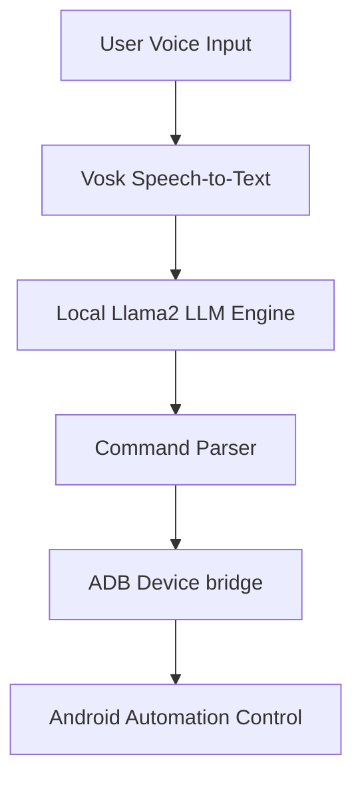
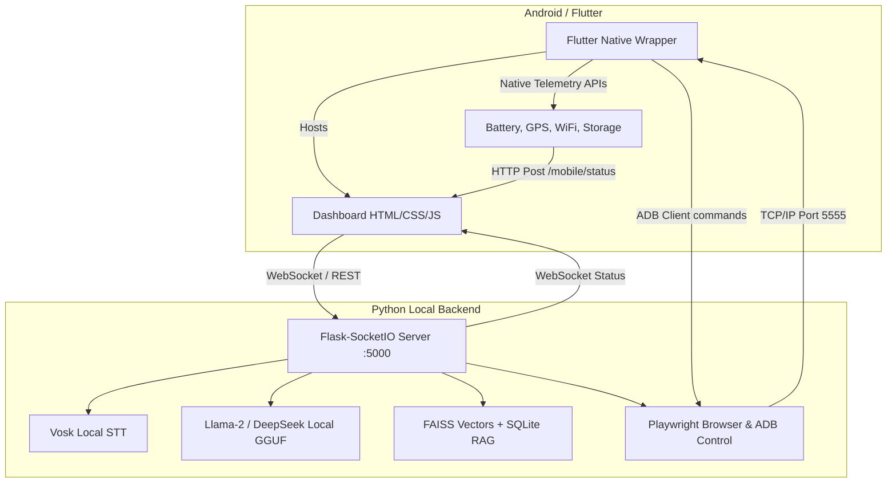
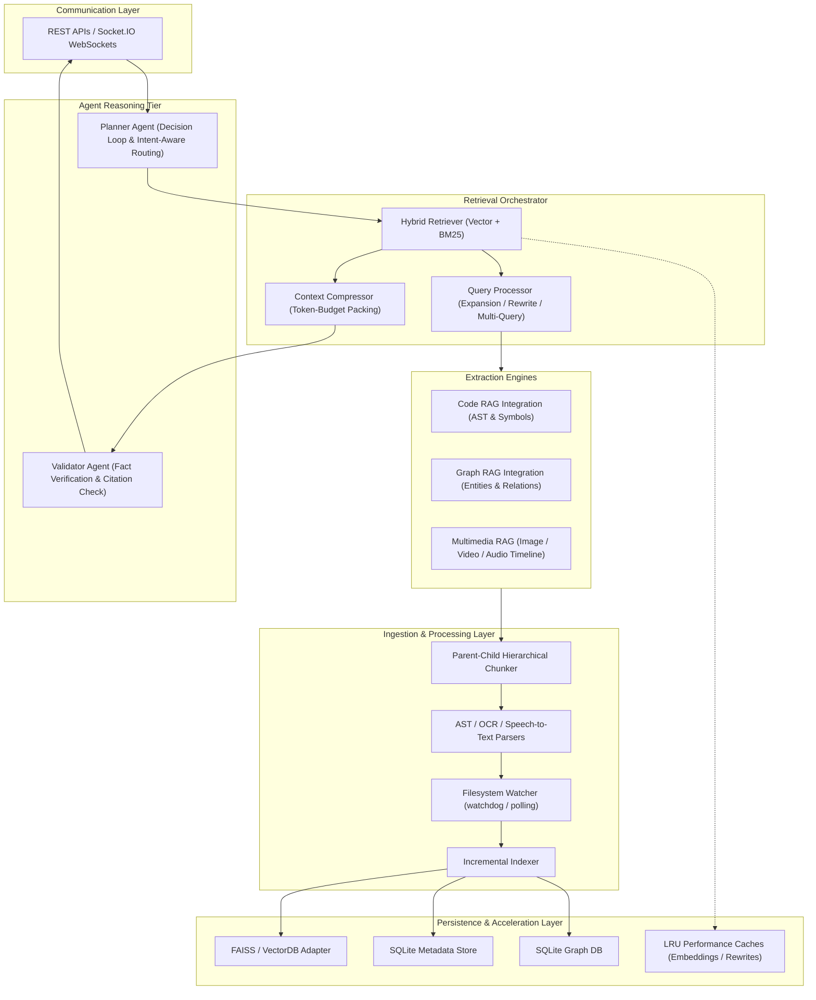
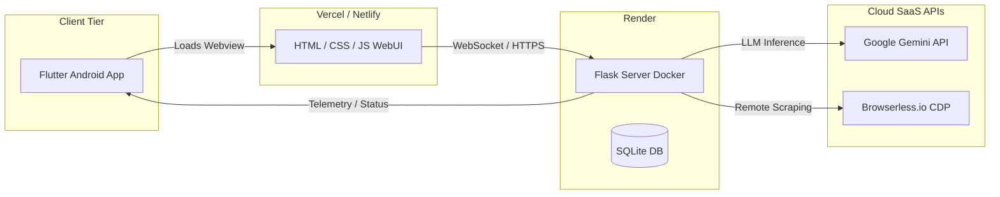
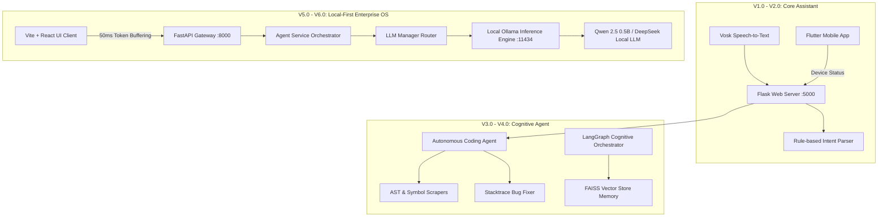

<!-- ========== NEW: ANIMATED WAVE HEADER ========== -->
<!-- ========== NEW: TYPING ANIMATION INTRO ========== -->
<p align="center">
  
</p>

<!-- ========== NEW: HIGH QUALITY PROJECT BANNER ========== -->


<!-- ========== NEW: AUTHOR & ARCHITECT SECTION ========== -->
## 👨‍💻 Author & Architect

<table>
<tr>
<td align="center" width="160">
  <a href="https://github.com/Sadique721">
    <br>
    <b>Md Sadique Amin</b><br>
    <sub>Backend Java Developer</sub>
  </a>
</td>
<td>

**Md Sadique Amin** — Backend Java Developer.

- 🔗 GitHub: [@Sadique721](https://github.com/Sadique721)
- 📧 Email: mdsadiqueamin721786@gmail.com
- 🏗️ Built: Enterprise BSS-OSS Telecom Suite, Backend Java Developer, IR Interconnect & Roaming

</td>
</tr>
</table>

<!-- ========== NEW: SYSTEM DIAGRAM SECTION ========== -->
## 📊 System Architecture & Workflow



---

<!--
███╗   ███╗███████╗ █████╗      █████╗ ██╗     █████╗  ██████╗ ███████╗███╗   ██╗████████╗
████╗ ████║██╔════╝██╔══██╗    ██╔══██╗██║    ██╔══██╗██╔════╝ ██╔════╝████╗  ██║╚══██╔══╝
██╔████╔██║███████╗███████║    ███████║██║    ███████║██║  ███╗█████╗  ██╔██╗ ██║   ██║   
██║╚██╔╝██║╚════██║██╔══██║    ██╔══██║██║    ██╔══██║██║   ██║██╔══╝  ██║╚██╗██║   ██║   
██║ ╚═╝ ██║███████║██║  ██║    ██║  ██║██║    ██║  ██║╚██████╔╝███████╗██║ ╚████║   ██║   
╚═╝     ╚═╝╚══════╝╚═╝  ╚═╝    ╚═╝  ╚═╝╚═╝    ╚═╝  ╚═╝ ╚═════╝ ╚══════╝╚═╝  ╚═══╝   ╚═╝   
-->

# 🚀✨ MSA AI AGENT – Ultimate Offline AI Agent & Software Engineering Assistant ✨🚀

> **⚡ Your Personal AI Assistant — Fully Offline, Private, Powerful, Autonomous**

[](https://github.com/Sadique721/AI-Agent-MSA-)
[](https://github.com/Sadique721/AI-Agent-MSA-)
[](https://python.org)
[](https://flutter.dev)

<p align="center">
  <i>No cloud data leakage. No subscription fees. No tracking. 👉 Just pure private AI power.</i><br>
  <b>Say "Hey MSA" 🎤 …and your intelligent assistant comes alive 🔥</b>
</p>

---

## 📖 Table of Contents

1. [🌟 What is MSA AI AGENT?](#-what-is-msa-ai-agent)
2. [🏗️ Enterprise Hybrid RAG Architecture](#️-enterprise-hybrid-rag-architecture)
3. [🔥 Core Features](#-core-features)
4. [🧠 Technology Stack](#-technology-stack)
5. [📁 Project Structure](#-project-structure)
6. [⚙️ Installation Guide](#️-installation-guide)
7. [🔐 Voice Training (Siamese Network)](#-voice-training-siamese-network)
8. [💻 Coding Agent (Phase 3 Upgrade)](#-coding-agent-phase-3-upgrade)
9. [🚀 Running the System](#-running-the-system)
10. [🧪 Unit Testing & Validation](#-unit-testing--validation)
11. [📱 Flutter Mobile Client & Telemetry](#-flutter-mobile-client--telemetry)
12. [☁️ Advanced Online Deployment Strategy](#-advanced-online-deployment-strategy-vercel-netlify--render)
13. [📈 Evolution Timeline & Architecture Upgrades](#-evolution-timeline--architecture-upgrades-v10-to-v60)
14. [⚔️ Comparative Advantages](#️-comparative-advantages)

---

## 🌟 What is MSA AI AGENT?

**MSA AI AGENT** is a next‑generation **offline AI assistant and Software Engineering Agent** that runs locally on your machine and coordinates various specialized agents to execute system tasks, automate web browser actions, generate production-ready code, and control your mobile device over Wi‑Fi.

### 🏗️ MSA AI Agent Architecture Diagram



> [!IMPORTANT]
> **100% local execution**: Speech Recognition (Vosk), LLM reasoning engines (Llama-2/DeepSeek GGUF or local Ollama), FAISS vector memory, and OpenCV vision models run locally on your CPU/GPU. No personal data or private code ever leaves your device.

---

## 🏗️ Enterprise Hybrid RAG Architecture

The platform integrates a production-grade, modular, offline-first Hybrid Retrieval-Augmented Generation (RAG) system:



### Proposed Architecture Subsystems:

*   **REST APIs / WebSockets**: Exposes endpoints (`/rag/query`, `/rag/query/rewrite`, `/rag/query/expand`, etc.) and triggers realtime indexing and search progress sockets.
*   **Planner Agent (Decision Loop)**: Conducts intent-aware RAG selection (deciding between Code, Graph, Image, Video, Audio, or Memory).
*   **Validator Agent (Citation & Hallucination Check)**: Computes fact consistency scores and maps claims to original document citations.
*   **Query Processor**: Performs typographical correction, synonymous keyword expansions, and multi-query variant generation.
*   **Hybrid Retriever**: Blends FAISS dense vectors and SQLite BM25 sparse matches via Reciprocal Rank Fusion (RRF) and Cross-Encoder reranking.
*   **Graph RAG Integration (Entities & Relations)**: Builds a semantic SQLite Graph DB, extracting entities/edges with automatic regex fallbacks.
*   **Code RAG Integration (AST & Symbols)**: Compiles structural definitions for Python, Java, JS, TS, Go, Rust, Kotlin, Dart, SQL, etc., mapping symbol imports and exports.
*   **Multimedia RAG (Image / Video / Audio)**: Extracts timeline events, frame segmentation (OpenCV), PIL metadata, and transcripts.
*   **Filesystem Watcher**: Listens to directories to trigger background index synchronization.
*   **Incremental Indexer**: Detects document deletions and updates without re-embedding the whole library.
*   **Parent-Child Hierarchical Chunker**: Maps smaller child search vectors to comprehensive parent chunks, preventing infinite loops.
*   **AST / OCR / Speech-to-Text Parsers**: Parses programming structures, screen pixels, and microphone sound feeds.
*   **FAISS / VectorDB Adapter**: Abstract adapter supporting FAISS, Chroma, and Qdrant database engines.
*   **SQLite Metadata Store**: Manages chunk indexes, document properties, and file states.
*   **SQLite Graph DB**: Houses Knowledge Graph nodes and multi-hop traversal relationships.
*   **LRU Performance Caches**: Thread-safe caching of embeddings and search rewrites.
*   **Context Compressor**: Deduplicates redundant snippets and packs context to match LLM token budgets.

---

## 🔥 Core Features

| Category | Feature | Description |
|----------|---------|-------------|
| 🎙️ **Voice Intelligence** | Offline Speech Recognition | Vosk – speech‑to‑text without internet |
| | Speaker Verification | Custom embeddings + Siamese network: only **your** voice activates the agent |
| | Bilingual Support | Naturally handles Hindi & Hinglish commands |
| 🧠 **Local Memory** | RAG Memory System | FAISS vector database + SQLite storage for long‑term facts and context |
| | Conversation Logs | Encrypted local chat history database |
| 📱 **Mobile Control** | Flutter App Wrapper | Mobile WebView client that uploads device state context (battery, network, GPS) |
| | ADB Control Plane | Control Android emulator/device over local Wi‑Fi: open apps, take screenshots, capture inputs |
| 👁️ **Computer Vision** | Object Detection | OpenCV‑based screen parsing, template matching, and camera automation |
| 💻 **Coding Agent** | Autonomous Coding Engine | Generates production code, reviews logic, explains algorithms, and refactors legacy scripts |
| | Stack Trace Analyzer | Pinpoints root causes and lists ranked fixes for Java, Node, Python exceptions |
| | Project Scaffolder | Generates complete Angular, React, Node, Spring Boot project templates |

---

## 🧠 Technology Stack

* **Backend Core**: Python 3.14+ (Flask, Flask-SocketIO, gevent-websocket)
* **Local LLM**: Llama 2 / DeepSeek-R1 (GGUF via `llama-cpp-python` or local Ollama client)
* **Vector Database**: FAISS (Facebook AI Similarity Search) + SQLite
* **Text Embeddings**: `sentence-transformers/all-MiniLM-L6-v2`
* **Voice Recognition**: Vosk offline speech API
* **Audio Capture**: PyAudio / PortAudio
* **Computer Vision**: OpenCV (`opencv-python`)
* **Mobile Connection**: Android Debug Bridge (ADB) over TCP/IP
* **Mobile Client**: Dart & Flutter SDK with `webview_flutter`, `permission_handler`, `battery_plus`, and `connectivity_plus`

---

## 📁 Project Structure

```bash
msa_agent/
├── 📁 agent/                  # AI reasoning & planning agents
│   ├── ReasoningEngine.py     # Main logical coordinator
│   └── Planner.py             # Complex task decomposition engine
├── 📁 backend/                # Server core logic
│   └── server.py              # Flask-SocketIO REST & WS router (port 5000)
├── 📁 browser_agent/          # Browser automation and Playwright controllers
├── 📁 coding/                 # 💻 Phase-3 Coding Agent System
│   ├── CodingAgent.py         # Main router and controller
│   ├── CodeGenerator.py       # Boilerplate boilerplate creator
│   ├── StackTraceAnalyzer.py  # Regex and LLM parser for exception traces
│   ├── BugAnalyzer.py         # Runtime logs & configurations verification
│   ├── CodeReviewer.py        # SOLID, DRY, naming, and architectural grader
│   ├── ProjectGenerator.py    # Multi-file scaffolding for Maven / React / Angular
│   ├── RefactorEngine.py      # Duplicate code remover & optimizer
│   ├── CodeExplainer.py       # Algorithmic flow explainer
│   ├── CodingMemory.py        # FAISS database gateway (remembering projects/fixes)
│   └── CodingValidator.py     # Compile check and import sanity validator
├── 📁 data/                   # Encrypted logs, conversation history, SQLite DB
├── 📁 flutter_app/            # 📱 Flutter mobile client codebase
│   ├── 📁 lib/
│   │   ├── main.dart                 # WebView wrapper & asynchronous JavaScript bridge
│   │   ├── 📁 services/
│   │   │   ├── code_client.dart      # REST Client wrapper for coding API
│   │   │   ├── reasoning_client.dart # Sends telemetry and polls backend status
│   │   │   └── validation_service.dart# Validates mobile triggers/alarms
│   │   └── 📁 utils/
│   │       └── device_telemetry.dart # Collects battery, Wi-Fi, connectivity, storage
│   └── pubspec.yaml           # Flutter dependencies
├── 📁 memory/                 # Core RAG long‑term memory management
│   └── rag_memory.py          # SQLite + FAISS wrapper class
├── 📁 models/                 # AI model assets (GGUF, Vosk voice models)
├── 📁 tests/                  # 🧪 pytest comprehensive unit test suite
│   ├── test_coding_memory.py
│   ├── test_coding_validator.py
│   ├── test_stacktrace_analyzer.py
│   └── test_enterprise_rag.py # 🧪 Hybrid RAG test suite
├── 📄 config.py               # Central environment configurations
├── 📄 main.py                 # Main backend orchestrator launcher
├── 📄 HOW_TO_USE.txt          # Quick start developer manual
└── 📄 README.md               # Visual user manual
```

---

## ⚙️ Installation Guide

### Prerequisites
1. **Python 3.14+** (Ensure it is on your environment PATH)
2. **Android SDK & platform-tools** (requires `adb` to run Android tasks)
3. **Flutter & Dart SDK** (to build the mobile application)

### Step 1: Install Python Dependencies
```bash
python -m pip install --upgrade pip
python -m pip install -r requirements.txt
```

### Step 2: Configure Local Models
Create a `models/` directory and place your local offline models inside:
- **Speech recognition**: Extract a Vosk model to `models/vosk/`
- **Large Language Model**: Put a `.gguf` file in `models/llm/` and verify the path matches in `config.py` (or start a local Ollama instance).

---

## 🔐 Voice Training (Siamese Network)

To train the Speaker Verification Siamese network to identify your voice:
1. Run the enrollment script:
   ```bash
   python scripts/voice_enrollment.py
   ```
2. Speak the wakeword `"Hey MSA"` clearly.
3. The Siamese network generates and saves your unique voice embedding profile locally to verify and protect device commands.

---

## 💻 Coding Agent (Phase 3 Upgrade)

The Phase 3 upgrade introduces a fully local software engineering pipeline. The assistant automatically intercepts programming requests and routes them to dedicated subsystems.

### Core Endpoints

* **`POST /api/code/generate`**: Generates production-ready REST APIs, microservices, repositories, and controllers.
* **`POST /api/code/review`**: Analyzes code against SOLID, DRY, and security rules. Returns scores and comments.
* **`POST /api/code/project`**: Generates project structures for Angular, Spring Boot, React, and Node.js.
* **`POST /api/code/stacktrace`**: Parses Exception traces (Java, Python, JS) to find files, line numbers, and rank bugfixes.
* **`GET /api/code/history`**: Lists history logs of all projects, fixes, and reviews stored in the RAG memory database.

---

## 🚀 Running the System

### 1. Launch the Backend Server
```bash
python main.py
```
*The server will start on `http://localhost:5000`.*

### 2. Boot up the Android Emulator
Make sure your emulator AVD matches your settings (e.g. `medium_phone`) and launch it:
```bash
"C:\Users\MD SADIQUE AMIN\AppData\Local\Android\Sdk\emulator\emulator.exe" -avd medium_phone -no-audio -no-boot-anim -gpu swiftshader_indirect
```

### 3. Install and Launch the Flutter App
```bash
# Move to the Flutter folder
cd flutter_app

# Fetch dependencies
flutter pub get

# Launch on the active emulator/device
flutter run
```

---

## 🧪 Unit Testing & Validation

Run the pytest suite to verify all logic systems are performing correctly:
```bash
python -m pytest --ignore=test_api.py
```

> [!TIP]
> This suite includes **433 automated test cases** checking the AST parser, coding validator compiler checks, refactor engines, RAG database storage, and LLM retry logics. Ensure you maintain 100% pass rates on modification.

---

## 📱 Flutter Mobile Client & Telemetry

The legacy native Android (Kotlin) app has been completely removed and replaced by a unified **Flutter application** (`flutter_app/`).

### Device Context & Telemetry
The Flutter client gathers the host system status parameters and uploads them to the server to populate the Reasoning Engine's planning context:
* **Battery State**: Power level (%), temperature, charging status.
* **Connectivity**: WiFi SSID, connection status, signal strength.
* **Storage info**: Free/Total local storage capacity.
* **Device details**: Manufacturer, model, OS build number.

### Asynchronous JavaScript Bridge
WebViews do not natively support synchronous return types from JavaScript interfaces. We solved this by implementing an custom asynchronous JS Channel bridge in `lib/main.dart`:
1. The dashboard page requests actions from the device.
2. A script injected on page finish captures these requests and forwards them to Flutter's `webview_flutter` `JavaScriptChannel`.
3. Flutter processes the requests asynchronously (e.g., retrieving GPS coordinates, reading battery, launching alarms).
4. Flutter fires the result back into the WebView via `runJavaScript` to update the user interface dynamically.

---

## ☁️ Advanced Online Deployment Strategy (Vercel, Netlify & Render)

To deploy the system online in a decoupled manner (frontend on static web CDN, backend on container hosting, and remote external APIs for model inference):



For detailed deployment roadmap, setup scripts, and configurations, refer to the [Advanced Deployment Analysis Report](file:///C:/Users/MD SADIQUE AMIN/.gemini/antigravity-ide/brain/7051c7b6-e6f6-41c1-8d77-cb9dc25b4dfd/msa_agent_analysis.md).

---

## 📈 Evolution Timeline & Architecture Upgrades (V1.0 to V6.0)

The MSA AI Agent has evolved from a simple voice-controlled offline helper into a high-performance, local-first enterprise AI Operating System.



### Version Evolution History:

#### 🟢 V1.0 - Offline Voice Foundations
- **Features:** Vosk speech-to-text recognition, offline audio transcription, and a local Flask gateway.
- **Intent Engine:** Direct keyword mapping to execute basic local system commands (e.g. open apps, show time).

#### 🟢 V2.0 - Hybrid Context & Device Control
- **Features:** Unified Flutter mobile app wrapper replaces Kotlin codebase.
- **Telemetry:** Asynchronous JS bridge uploads battery status, Wifi, GPS location, and system info to host PC.

#### 🟢 V3.0 - Autonomous Coding Engine (Phase 3)
- **Features:** Scaffolding automation (Angular, React, Node, Spring Boot), AST compiler validator, logic refactoring engine, and regex stacktrace exception parsing.

#### 🟢 V4.0 - Cognitive Core & Advanced RAG (Phase 4)
- **Features:** LangGraph orchestrator node-based loops, FAISS semantic vector memory retrieval, query expansions, entity relations SQLite graph, and context compressor.

#### 🟢 V5.0 - Enterprise UX & Parallel Gateways (Phase 5)
- **Features:** Dual gateway servers (FastAPI Gateway alongside Flask backend), background agent coordinator, Zustand React rendering optimizer, and 50ms token stream throttling.

#### 🟢 V6.0 - Local-First AI Inference & Health Validation (Phase 6)
- **Features:** Complete local LLM routing via Ollama (`qwen2.5:0.5b` default), LiteLLM failover router, silent installers, and 30-second cold-start warm caching timeouts.

---

## ⚔️ Comparative Advantages

For a deep comparison between the offline **MSA AI AGENT** and global systems like ChatGPT, DeepSeek, Claude, and Gemini, read the [Comparative Report](file:///d:/My%20Self%20Details/Programs/AI/msa_agent/MSA_AI_AGENT_VS_GLOBAL_AI_PLATFORMS.md).

* **100% Privacy**: No code or conversation logs are leaked to external servers.
* **Zero Cost**: Works without subscription limits or token fees.
* **Hardware Integration**: Directly interfaces with local compilation and device hardware.


<!-- ========== NEW: FOOTER WAVE ANIMATION ========== -->
<p align="center">
  
</p>