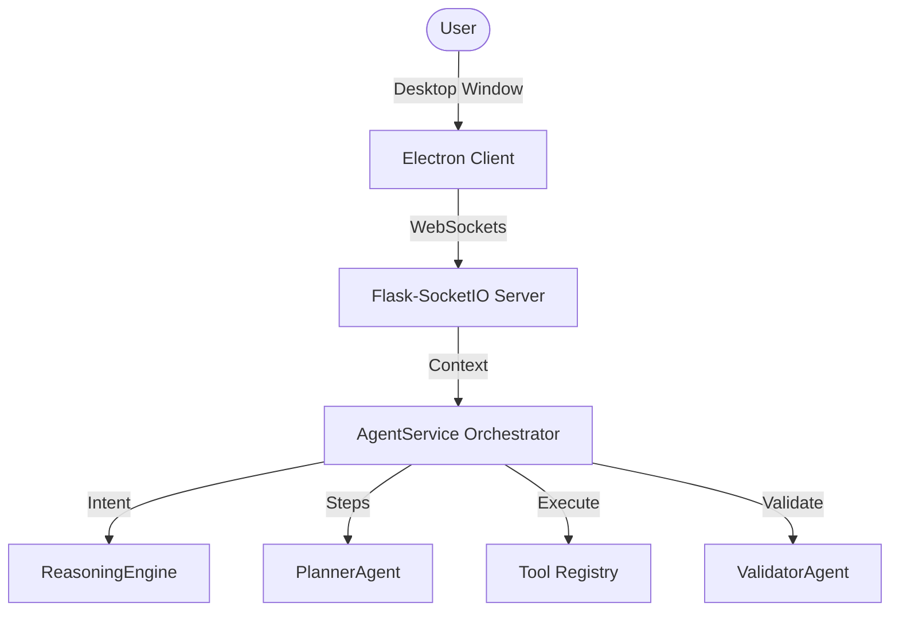

# Architecture Specification — MSA AI Agent V4.5

This document details the enterprise system layout, service topologies, and structural boundaries of the local-first Multi-Agent System.

## Subsystems Layout

## Service Registration
All helper agents register inside the central `AgentService` dependency container to avoid circular dependency cycles and memory leaks.
