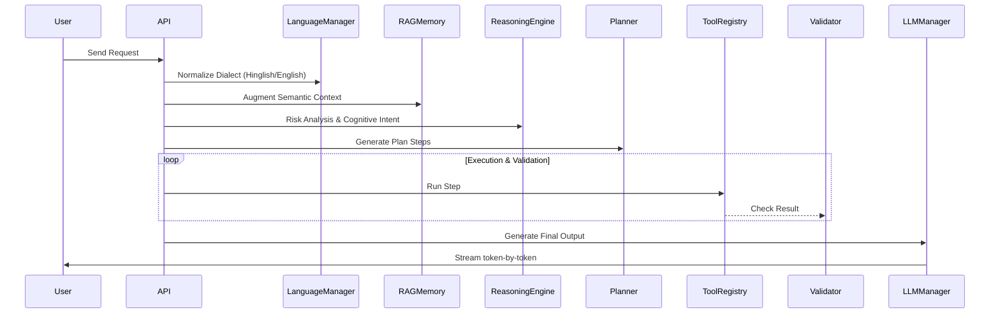

# Execution Pipeline — MSA AI Agent V4.5

Details the sequential path of input processing, execution loops, and validation checks.

## Flow Sequences

```mermaid
sequenceDiagram
    User->>API: Send Request
    API->>LanguageManager: Normalize Dialect (Hinglish/English)
    API->>RAGMemory: Augment Semantic Context
    API->>ReasoningEngine: Risk Analysis & Cognitive Intent
    API->>Planner: Generate Plan Steps
    loop Execution & Validation
        API->>ToolRegistry: Run Step
        ToolRegistry-->>Validator: Check Result
    end
    API->>LLMManager: Generate Final Output
    LLMManager->>User: Stream token-by-token
```
